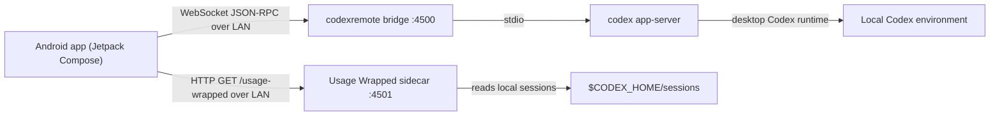

# Codex Mobile Deep Dive

## 1. Executive Summary

Codex Mobile is a native Android companion for Codex. It lets a user monitor, steer, and approve work from a phone while the real Codex execution stays on a desktop machine.

The product is intentionally narrow:

- the desktop remains the source of truth and execution boundary
- the phone is a thin but rich client
- the connection model is LAN-first
- the user runs `npx codexremote` on the desktop to expose a mobile bridge and usage sidecar

The result is a mobile app that can:

- connect to a desktop by QR code, short code, or manual host entry
- restore and maintain an active desktop session
- browse many threads efficiently
- open a full thread transcript with live updates
- handle approvals and tool-driven input requests
- inspect diffs and technical execution artifacts
- surface local usage analytics from desktop session history

This document explains what the app is, why it exists, how it is structured, the core architectural decisions behind it, what we shipped, and the trade-offs we intentionally accepted.

## 2. Why This App Exists

Codex work is often long-running. The desktop session may continue streaming, wait on approval, or finish with a meaningful result after the user has stepped away from the desk. A desktop-only workflow creates three recurring problems:

1. Long-running work is easy to lose track of when the user leaves the laptop.
2. Approval gates block progress until the user returns.
3. The desktop transcript contains a lot of useful operational detail, but it is not available from a phone.

Codex Mobile exists to solve that gap without trying to recreate the full desktop product. The goal is not "run Codex on Android." The goal is "stay in control of a desktop Codex session from Android."

## 3. Product Scope

### In Scope

- Pairing a phone to a desktop Codex session
- Reading thread history and live thread state
- Sending follow-up prompts into an existing thread
- Creating a new thread, optionally scoped to a workspace directory
- Reviewing diffs and execution history
- Handling approval requests and user-input requests
- Viewing usage analytics derived from local Codex session history
- Background session persistence while a host is active

### Out of Scope

- Running models on-device
- Hosting a cloud backend for relay or synchronization
- Public internet exposure
- Replacing the desktop interface
- Becoming a generalized consumer chat app

The app is a power-user companion. It is optimized for people who are already using Codex on a desktop and want continuity when they are away from it.

## 4. High-Level System Design

There are four important runtime pieces:

1. **Android app**
   - Native Kotlin app
   - Maintains UI state, cached thread state, connection state, and host profiles
   - Talks to the desktop bridge over WebSocket
   - Talks to the usage sidecar over HTTP

2. **`codexremote`**
   - Desktop CLI entrypoint
   - Starts or reuses the mobile bridge on port `4500`
   - Starts or reuses the usage history sidecar on port `4501`
   - Prints the QR code and short connection code for pairing

3. **Codex bridge**
   - A desktop-side WebSocket server
   - Launches `codex app-server` over `stdio`
   - Adapts the desktop app-server protocol into a mobile-consumable LAN endpoint

4. **Usage Wrapped sidecar**
   - Reads local Codex session history from `CODEX_HOME`
   - Aggregates usage and activity data
   - Exposes a small HTTP API for the mobile analytics surface

The architectural idea is simple: keep all execution and durable source data on the desktop, and let the phone consume and control it remotely on a trusted local network.

## 5. Repository Structure

The repository currently contains three main pieces:

| Module / Area | Purpose |
| --- | --- |
| `app/` | Native Android client |
| `codexremote/` | Desktop bridge CLI and LAN bootstrap flow |
| `usage-wrapped-service/` | Kotlin JVM usage-history service module and tests |

Inside the Android app, the structure is intentionally feature-oriented:

- `app/src/main/java/dev/codex/mobile/app`
- `app/src/main/java/dev/codex/mobile/navigation`
- `app/src/main/java/dev/codex/mobile/core`
- `app/src/main/java/dev/codex/mobile/feature`

The `core` package holds shared models, repository contracts, data implementations, theming, and utilities. The `feature` package holds screen-level UI and state.

## 6. Technology Stack

### Android Client

- Kotlin
- Jetpack Compose
- Material 3
- Android ViewModel + StateFlow
- Navigation Compose
- Kotlin serialization
- OkHttp WebSockets
- Google code scanner for QR bootstrap

Build profile:

- `compileSdk` 36
- `targetSdk` 36
- `minSdk` 29
- Kotlin `2.3.10`
- Android Gradle Plugin `8.13.2`

### Desktop and Bridge

- Node.js for `codexremote`
- WebSocket bridge on port `4500`
- local HTTP usage sidecar on port `4501`
- `codex app-server` launched behind the bridge over `stdio`

### Supporting Modules

- `usage-wrapped-service` Kotlin JVM module for usage-history serving and aggregation logic
- repository-local design docs under `docs/plans/` documenting major product and UX decisions

## 7. Core Product Decisions

### 7.1 Native Android, Not a Web Wrapper

The app is built as a Kotlin + Jetpack Compose Android app rather than a React Native or web wrapper. That choice optimizes for:

- fluid Android-native interaction
- granular Compose control over dense thread UIs
- direct use of Android foreground services, notifications, QR scanning, and media/photo pickers
- lower runtime complexity for a single-platform product

### 7.2 Thin Client, Rich Client

The phone is intentionally a **thin** client from an execution standpoint and a **rich** client from a UX standpoint.

That means:

- the desktop executes Codex
- the phone renders high-density state, interaction, and monitoring surfaces
- the phone caches enough local state to feel responsive after reconnect and app relaunch

This avoids moving secrets, execution privileges, or tool runtime complexity onto the phone.

### 7.3 LAN-First Instead of a Hosted Backend

The system does not introduce a cloud relay. The user runs `npx codexremote` on the machine that is already running Codex.

Why:

- lower operating cost
- faster time to ship
- better privacy story for a power-user tool
- no need to replicate the Codex execution environment in the cloud

Trade-off:

- the app depends on the desktop bridge being online
- the user must be on a trusted local network
- the product is deliberately not positioned as an internet-accessible remote IDE

### 7.4 Manual DI Instead of Hilt

The app uses a lightweight manual graph in `CodexAppGraph` instead of Hilt.

Why:

- there is currently one dominant repository dependency
- the app is still compact enough that manual wiring is lower ceremony
- it keeps bootstrapping simple and explicit

Trade-off:

- less scalable than a full DI framework if the graph grows much larger
- more manual initialization responsibility

### 7.5 File-Backed Local State Instead of Room

The app persists local state to a JSON file via `AppLocalStateStore` rather than using Room.

Why:

- the app mostly needs lightweight persistence for host profiles, preferences, thread item cache, and thread settings
- there is no complex relational query layer
- a single file keeps persistence straightforward

Trade-off:

- less query flexibility than a database
- more manual responsibility around state shape and migration if persistence becomes richer

## 8. End-to-End Flow

### 8.1 Pairing

The primary pairing flow is:

1. User runs `npx codexremote` on desktop
2. Desktop CLI prints:
   - WebSocket address
   - usage-wrapped address
   - short connection code
   - QR code
3. User opens Codex Mobile
4. User scans QR code or enters the short code
5. App resolves bootstrap details into a `HostProfile`
6. The host is saved and marked active
7. Repository opens the WebSocket session and loads initial data

The app also supports manual host and port entry as a fallback.

### 8.2 Session Restore

On app launch:

1. `CodexMobileApp` initializes the app graph
2. `AppServerCodexRepository` restores locally persisted state
3. The active host, if any, is rehydrated
4. The root starts a foreground service when a host is active
5. The repository reconnects to the active host if needed

This gives the app continuity across process death, backgrounding, and normal reopen flows.

### 8.3 Thread Control Loop

For a live thread:

1. Desktop stream events arrive over JSON-RPC notifications
2. Repository merges them into thread state
3. ViewModel combines repository flows into screen state
4. Compose renders user messages, agent messages, and technical execution strips
5. The user can:
   - send another prompt
   - approve or deny an action
   - inspect diffs
   - respond to user-input prompts
   - interrupt a running turn

## 9. Android Client Architecture

## 9.1 App Shell

The app entry stack is:

- `CodexMobileApp`
- `MainActivity`
- `CodexMobileRoot`
- `CodexNavHost`

`CodexMobileRoot` is the app-level coordinator. It is responsible for:

- applying theme preference
- collecting global app state
- requesting notification permission when needed
- starting and stopping the background connection service
- surfacing in-app alerts

`CodexNavHost` owns app navigation and top-level destinations:

- Dashboard
- Threads
- Approvals
- Settings

Secondary destinations:

- Host Connection
- Usage Wrapped
- Thread Detail

## 9.2 State Management

The state flow architecture is:

- repository emits canonical domain flows
- feature `ViewModel`s combine those flows into screen-specific `UiState`
- Composables render from immutable state snapshots

This keeps the UI reactive while preserving a single source of truth for connection state, thread state, approvals, and host profiles.

## 9.3 Repository Pattern

`CodexRepository` is the contract that the UI depends on. It exposes:

- host management
- connection state
- account and rate-limit state
- thread summaries and thread detail
- approvals
- dynamic-tool requests
- user-input requests
- usage-wrapped state
- in-app thread notifications
- command APIs for replying, interrupting, connecting, refreshing, and resolving requests

The concrete implementation is `AppServerCodexRepository`.

This class is the central orchestration layer. It handles:

- local state restore and persistence
- session lifecycle
- reconnect behavior
- thread summary refresh
- thread detail merge logic
- active-item tracking
- approval and request queues
- composer catalog refresh
- unread result digest tracking
- in-app notification generation

This repository is intentionally heavy. It exists to isolate the rest of the app from protocol and synchronization complexity.

## 9.4 Transport Layer

`CodexJsonRpcTransport` wraps the WebSocket connection and handles:

- request/response correlation
- server notifications
- server-initiated requests
- transport open/close/failure events

`CodexAppServerSession` sits above the transport and exposes semantic operations such as:

- `thread/list`
- `thread/read`
- `thread/start`
- `thread/resume`
- `turn/start`
- `turn/steer`
- `turn/interrupt`
- `model/list`
- `skills/list`
- account and rate-limit queries

This separation matters:

- transport handles the wire contract
- session handles protocol semantics
- repository handles app state and UX consequences

## 9.5 Local Persistence

`AppLocalStateStore` persists:

- app preferences
- remembered hosts
- cached thread items
- persisted thread session settings

The local persistence goal is not offline authoring. It is fast reload and continuity. Cached thread items also help preserve transcript richness across reopen flows when the desktop snapshot is temporarily thinner than previously observed live data.

## 10. Desktop Bridge Architecture

## 10.1 `codexremote`

`codexremote` is the operator-facing CLI.

Responsibilities:

- detect LAN IPv4
- start or reuse bridge on `4500`
- start or reuse usage sidecar on `4501`
- print pairing instructions, QR, and short code

This is a product decision as much as a technical one. The bridge command is the setup story.

## 10.2 Bridge Server

The bridge server:

- runs on the desktop
- accepts one mobile client at a time
- spawns `codex app-server` behind the scenes over `stdio`
- exposes the bridge over WebSocket
- keeps server requests pending until the mobile client is initialized

This design preserves the desktop as the actual Codex runtime while giving the phone a clean LAN endpoint.

The one-client-at-a-time rule is intentional. This product is optimized around a single mobile companion attached to a single live desktop session, not collaborative multiplexing from several phones at once.

## 10.3 Usage Wrapped Sidecar

The usage-wrapped story exists to expose desktop activity analytics to the phone without polluting the real-time app-server transport.

The sidecar:

- reads local session logs from `$CODEX_HOME/sessions`
- aggregates activity, tokens, cost estimate, streaks, and project/source summaries
- exposes an HTTP surface consumed by the phone

There are two relevant implementations in the repo:

- the mobile-facing runtime sidecar used by `codexremote`
- a Kotlin JVM `usage-wrapped-service` module that mirrors the domain and aggregation logic inside this repository

This separation is useful because usage analytics are structurally different from the live control plane.

## 11. Feature Deep Dive

## 11.1 Dashboard

The Dashboard is the at-a-glance home surface.

It combines:

- active host and connection status
- current active thread
- recent threads
- quota/rate-limit summary
- a summary callout into Usage Wrapped
- account status

Why it exists:

- a phone UX needs a home surface that answers "Is my desktop connected?" and "What needs attention?" quickly

Design characteristics:

- editorial rather than utility-first
- compact information density
- clear connection state strip
- quick jump into active work

## 11.2 Threads

The Threads screen originally rendered threads as a flat list. It now groups threads by workspace folder and supports:

- folder sections
- collapsible groups
- `Show more` within a folder
- search across title, preview, and visible directory name
- compact dense rows instead of heavy cards

Important design decisions:

- group by visible folder label derived from `cwd`
- sort folders by newest thread
- keep row density high for scanability
- preserve useful metadata without wasting space

Thread rows now prioritize:

- title
- unread result digest, when relevant
- relative time
- compact second line: `status • model • branch`

Title fallback was also cleaned up so the app prefers:

1. thread name
2. preview text
3. `<folder> thread`
4. generic final fallback

That removed a lot of noisy "Untitled thread" presentation.

## 11.3 Thread Detail

Thread Detail is the heart of the app.

It is built around a deliberate separation between:

- conversational content
- technical execution history
- decisions and approvals
- composer controls

### Transcript Row Model

`buildTranscriptRows()` converts raw thread items plus pending approvals and tool requests into a renderable transcript model:

- user message rows
- agent message rows
- technical strips
- approval cards
- user-input cards
- dynamic-tool request cards
- pending agent placeholder

This is a key architectural choice. The screen does not render the raw protocol list directly. It renders a transcript model designed for mobile comprehension.

### Technical Pill Strip

The technical pill strip is one of the most important UX decisions in the app.

Instead of rendering every technical event as a full-width transcript block, the app compresses execution artifacts into pill families:

- plan
- reasoning
- command
- patch
- MCP
- tool
- web
- collab
- review
- image
- system

Why:

- mobile screens do not tolerate a wall of technical blocks well
- users need to know what happened without losing the conversation
- technical detail should be available on demand, not always expanded

The current interaction model is:

- all pills stay visible
- tapping a pill opens a lightweight inline inspector
- full formatted content moves into a bottom sheet
- patch diff review uses a dedicated diff viewer sheet

This is a major readability and performance improvement over naive transcript rendering.

### Composer and Reply Flow

The composer supports:

- free-text reply
- model selection
- reasoning effort selection
- personality selection
- sandbox mode selection
- skill insertion
- image attachment
- interrupt action for active runs

This keeps the phone useful for both lightweight steering and high-signal follow-up.

## 11.4 Approvals

Approvals are important enough to have a dedicated screen as well as in-thread rendering.

The Approvals surface consolidates:

- command execution approvals
- file change approvals
- permissions approvals
- tool-driven user input prompts

Why:

- the most expensive failure mode on mobile is missing a gate that blocks desktop progress
- approvals need a queue surface, not just inline rendering

The dedicated screen turns approvals into a first-class operational workflow.

## 11.5 Usage Wrapped

Usage Wrapped is the analytics surface for the product.

It presents:

- overview metrics
- live quota windows
- heatmap activity
- highlights
- token breakdown
- approximate API-equivalent cost estimate

Why:

- Codex sessions produce interesting operational history
- the app should not only be a remote control; it should also help the user understand long-term usage patterns

The feature is intentionally framed as analytics from **local desktop history**, not cloud telemetry.

## 11.6 Settings and Host Management

The Settings and Host Connection surfaces handle:

- theme preference
- connection alerts
- connection/security notes
- remembered desktops
- host renaming and removal
- manual host entry
- QR bootstrap
- short code bootstrap

These surfaces matter because the product setup model depends on a user-run desktop bridge. Host management is not incidental. It is part of the product.

## 12. Key Domain Modeling Decisions

The app has a strong domain model layer under `core/model`.

Notable categories:

- `HostProfile`
- `ConnectionState` and `ConnectionPhase`
- `AccountState`
- `ThreadSummary`
- `ThreadDetail`
- `ThreadItem` sealed hierarchy
- `ApprovalItem` and approval decision models
- composer option models
- usage-wrapped models

### Why This Matters

The app is not just a socket client with ad hoc JSON parsing. The domain model gives the UI:

- stable semantics
- readable feature code
- testable transformations
- a place to encode presentation-relevant meaning such as thread status, folder label, preview text, and result digests

## 13. Performance and UX Decisions

Thread-heavy mobile UI was one of the hardest parts of the app. Several decisions were made specifically to keep large histories usable.

### 12.1 Transcript Performance

Key performance ideas:

- avoid treating the transcript as a naive list of uniformly expensive rich blocks
- keep a transcript-row model between raw thread items and UI
- use content typing in lazy lists
- reduce unnecessary whole-list invalidation
- preserve a fast path for simpler text rendering where possible

### 12.2 Technical Detail Deferral

One of the biggest improvements was moving heavy technical detail out of the main scroll path.

Instead of rendering full technical content inline for every execution artifact:

- pills stay visible for scanability
- inline inspector is intentionally cheap
- full content moves to a bottom sheet

This improved both readability and scroll cost.

### 12.3 Dense Thread List Rows

The Threads screen was tightened to avoid wasted space:

- fewer mini-cards
- denser rows
- better title fallback
- metadata line kept to a single muted row

The goal was to make many threads readable on a phone without the screen feeling bland or overloaded.

### 12.4 Folder-Based Thread Organization

Grouping threads by directory was a product-level UX choice:

- it maps more closely to how Codex work is organized in practice
- it scales better than a flat thread list
- it makes the app feel closer to real workspace context

## 14. Reliability and Lifecycle Decisions

## 14.1 Reconnect Behavior

Reconnect reliability is one of the most important product properties.

The repository includes logic for:

- restore active host from local state
- reconnect to the active desktop
- preserve caches during reconnect when appropriate
- transition between `Connecting`, `Reconnecting`, `Connected`, `Disconnected`, and `Error`
- backoff reconnect attempts

Host upsert and bootstrap matching were also tightened so rescanning a known desktop updates the remembered host instead of duplicating it or leaving stale endpoint data behind.

## 14.2 Background Connection

On Android, a normal backgrounded app cannot be trusted to keep a socket alive indefinitely. To address that, the app includes `ConnectionForegroundService`.

When a host is active:

- the app starts a foreground service
- the service shows an ongoing low-priority notification
- the service keeps the connection alive in the background
- the notification gives the user quick `Open app` and `Disconnect` actions

This is the correct Android-native answer for "stay connected unless I explicitly stop it."

## 14.3 In-App Alerts

The app also maintains an in-app notification layer for thread result digests and thread-linked alerts. This helps surface important desktop outcomes without forcing a full manual refresh.

## 15. Security, Safety, and Privacy Positioning

The product is intentionally scoped around a trusted local network.

Important facts:

- the app allows cleartext traffic
- the mobile transport is LAN-first
- the desktop bridge is user-run
- `codex app-server` stays local behind the bridge over `stdio`
- usage history is read from local desktop session files

Why this is acceptable for the current product:

- the product is explicitly a local companion
- it is not claiming to be a public internet remote-control system
- privacy is improved by keeping execution and history on the user’s own desktop

Trade-off:

- this is not a general-purpose hardened remote access architecture
- the user setup must make the LAN trust boundary clear

## 16. Quality Strategy

The quality strategy is pragmatic and layered.

### 15.1 Real Device First

The project guidance explicitly prioritizes a real Android phone over emulator-first workflows.

Why:

- connection behavior
- foreground service behavior
- notification permission flow
- dense transcript scrolling
- QR scanning

All of these are more truthfully validated on hardware.

### 15.2 Unit and UI Tests

The repository includes tests across several levels:

- thread summary presentation helpers
- thread folder section building
- thread diff parsing
- thread transcript row building
- connection bootstrap parsing and matching
- host upsert behavior
- threads view model filtering
- selected screen UI behavior
- bridge and usage aggregator tests in desktop-side modules

This is not exhaustive system automation, but it gives good coverage on the logic-heavy areas.

### 15.3 Logging

`AppLog` provides lightweight structured debug logging under the `CodexMobile` tag for:

- screen transitions
- host actions
- connection events
- thread refresh and snapshot merge behavior

The goal is operational visibility during development and real-device validation without committing to a full analytics stack.

## 17. Major Implemented Milestones

The current app is not a generic prototype. Several significant UX and architecture decisions are already implemented:

### Product and Infrastructure

- native Android shell and navigation
- LAN pairing via QR code, short code, and manual entry
- `codexremote` desktop bootstrap command
- bridge between mobile WebSocket and desktop `codex app-server`
- usage-wrapped local analytics surface

### Thread and Transcript UX

- thread history browsing
- folder-grouped threads with collapse and `Show more`
- directory-name-aware search
- compact, higher-signal nested rows
- better thread title fallback
- transcript row normalization
- technical pill strip
- full-content bottom sheet for technical items
- dedicated diff review sheet

### Reliability and Lifecycle

- local host persistence
- remembered host matching improvements
- reconnect behavior and state restore
- foreground service for true background connection persistence

### Actionability

- approval queue
- inline approval rendering
- tool prompt handling
- interrupt action
- rich composer configuration

## 18. Trade-Offs and Constraints

The app deliberately optimizes for a specific product shape rather than pretending to solve every problem.

### Constraint: No Cloud Backend

Benefit:

- low cost
- simple privacy model
- fast to ship

Trade-off:

- depends on a running desktop bridge
- same-network constraint

### Constraint: Mobile Is Not the Executor

Benefit:

- safer privilege boundary
- no local model/runtime complexity on phone

Trade-off:

- the phone cannot function without a desktop host

### Constraint: Dense Information on a Small Screen

Benefit:

- very high scan efficiency
- practical monitoring surface

Trade-off:

- requires careful UI compression and performance work

### Constraint: Android Lifecycle Reality

Benefit:

- native lifecycle handling and background service support

Trade-off:

- complexity around reconnect, notifications, and foreground service UX

## 19. What the App Achieves Today

Today, the app successfully demonstrates a credible mobile Codex companion with a coherent architecture.

It proves that:

- a phone can act as a practical remote surface for Codex
- the desktop can remain the secure execution boundary
- thread-heavy Codex workflows can be made legible on mobile
- approvals, diffs, and technical artifacts can be handled without drowning the UI
- local session analytics can become a useful secondary product surface

That is the real result of this project. It is not just "we connected a phone to a socket." It is a productized control surface for real Codex work.

## 20. Known Limitations

The app also has clear limits, many of them intentional:

- LAN-first, not internet-first
- depends on a running desktop bridge
- cleartext local-network transport
- no hosted identity or relay layer
- no desktopless mode
- no large-scale multi-user or enterprise admin model
- manual graph instead of full DI framework
- file-backed state instead of a heavier offline data architecture

These are not accidents. They are the current product boundary.

## 21. If We Had To Present This As a Project Deep Dive

The story to tell is:

1. **Problem**
   - Codex work is desktop-bound and long-running.

2. **Product thesis**
   - A phone can be a high-leverage companion if the desktop stays the executor.

3. **System design**
   - Android app + desktop bridge + local app-server + local usage sidecar.

4. **Architecture**
   - repository-centered state management, feature ViewModels, strong domain models, thin mobile client.

5. **UX differentiation**
   - folder-based thread browsing, technical pill strip, approvals as a first-class queue, usage analytics from local history.

6. **Reliability decisions**
   - persisted host state, reconnect flow, background connection via foreground service.

7. **Outcome**
   - a working, coherent, real-device Codex mobile companion optimized for power users.

## 22. Summary

Codex Mobile is a focused Android system, not just a screen demo.

It combines:

- a native mobile client
- a user-run desktop bridge
- a local analytics sidecar
- a repository-centered state architecture
- high-density thread and approval UX

The core philosophy is consistent throughout the codebase:

- keep execution on the desktop
- make the phone operationally powerful
- optimize for trusted-local-network use
- compress complexity into clear, mobile-native surfaces

That philosophy is what makes the project coherent.
